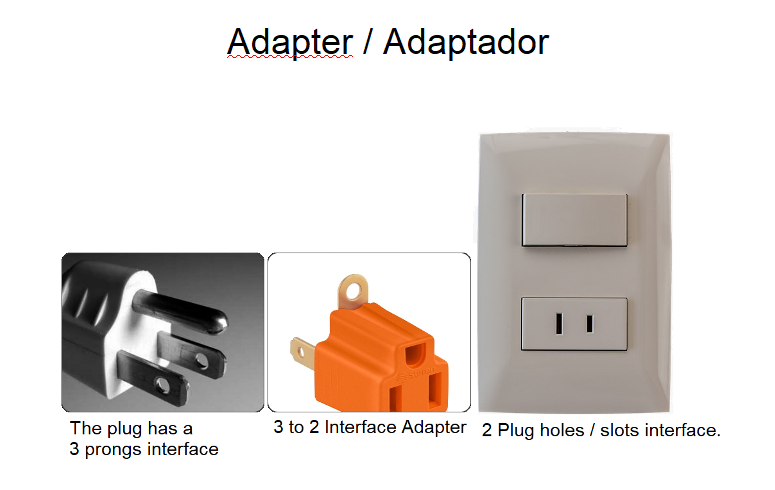

# Patron Adaptador

## Definicion
El patrón Adaptador es un patrón de diseño estructural en la programación orientada a objetos  que actúa como puente entre dos interfaces incompatibles.

## Donde se utilizan:

Esto resulta especialmente útil al integrar código heredado, bibliotecas de terceros o API externas que no siguen la estructura de la aplicación.

## Imagen mental

## Grupos de Patrones

* Creacionales → Creación de objetos.
* Estructurales → Organización de objetos.
* Comportamiento → Comunicación entre objetos.

